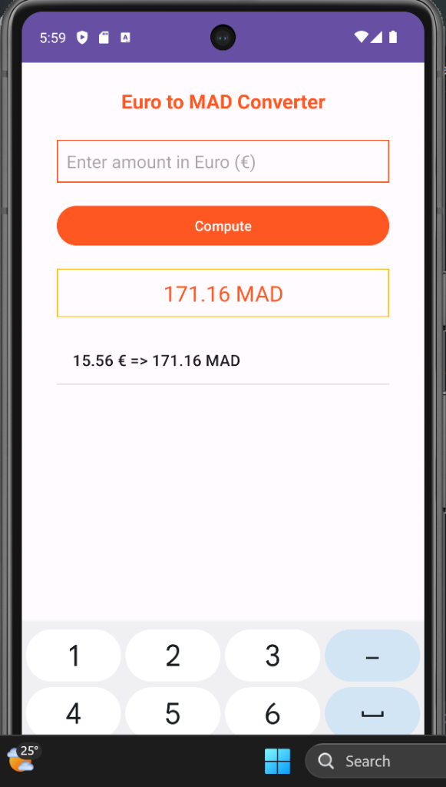
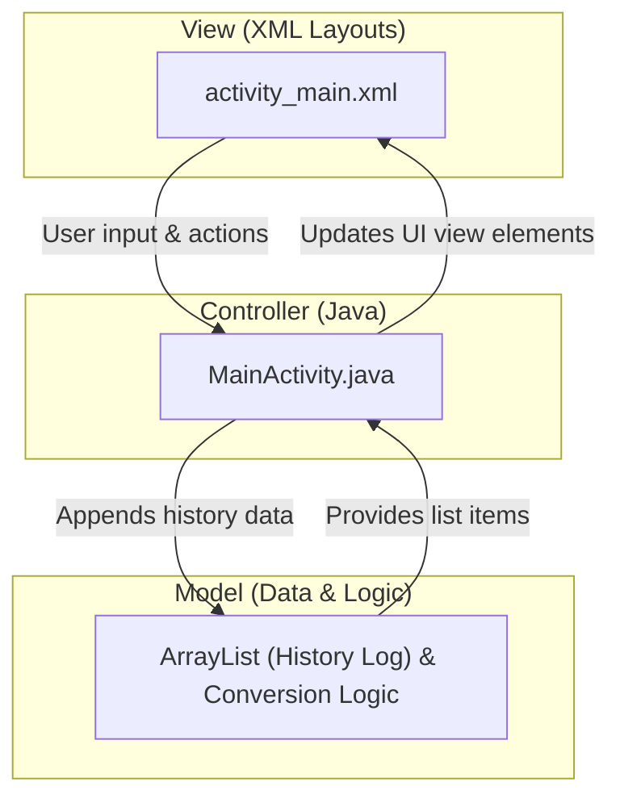

# Currency Converter: Euro to MAD (Moroccan Dirham)

**Author:** HYNDI ELMEHDI  
**Paradigm:** Native Android Development (Java & XML Layouts)

---

## 📱 Project Overview

This is an Android application that performs real-time currency conversions from **Euro (€)** to **Moroccan Dirham (MAD)** using a conversion rate of **1 € = 11.0 MAD**. 

It features:
1. A styled numeric input field for the Euro amount.
2. A calculation action button.
3. A styled output display showing the converted amount in MAD.
4. A scrollable history log listing all past calculations made during the session.

---

## 📸 App Preview



---


## 🛠️ Architectural Breakdown

The project follows a standard **Model-View-Controller (MVC)** architectural pattern:



Here is how each component is mapped to the codebase:

*   **Model (Data & Logic)**:
    *   **Data Structure**: A simple `ArrayList<String>` in `MainActivity` serves as our model storing the session history log.
    *   **Business Logic**: The currency conversion factor calculation `double result = amount * 11.0`.
*   **View (User Interface)**:
    *   **Layout**: [activity_main.xml](file:///C:/Users/thinkpad/AndroidStudioProjects/CurrencyConverter/app/src/main/res/layout/activity_main.xml) describes the screen arrangement including the input box (`EditText`), compute button (`Button`), conversion output display (`TextView`), and the scrollable list (`ListView`).
    *   **Styles & Tokens**: Defined in XML drawable custom shapes like [edit_text_style.xml](file:///C:/Users/thinkpad/AndroidStudioProjects/CurrencyConverter/app/src/main/res/drawable/edit_text_style.xml) and colors in [colors.xml](file:///C:/Users/thinkpad/AndroidStudioProjects/CurrencyConverter/app/src/main/res/values/colors.xml).
*   **Controller (Intermediary)**:
    *   **Binding & Logic Coordinator**: [MainActivity.java](file:///C:/Users/thinkpad/AndroidStudioProjects/CurrencyConverter/app/src/main/java/com/example/devise/MainActivity.java) connects the View's elements to code variables via `findViewById()`.
    *   **Event Handling**: Listens for click events via `setOnClickListener` on the compute button, validates the inputs, invokes the model conversion logic, updates the result display, and notifies the list view adapter (`ArrayAdapter.notifyDataSetChanged()`) to render the updated history list.

---

## 📂 Project Structure & Key Files Explained

Below is the explanation of each key file in this project, written to serve as an educational study guide.

---

### 1. The Design Tokens (Colors)
**File:** [app/src/main/res/values/colors.xml](file:///C:/Users/thinkpad/AndroidStudioProjects/CurrencyConverter/app/src/main/res/values/colors.xml)

This file stores hexadecimal color definitions to keep style assets consistent across the application. It acts as our design token library:
```xml
<?xml version="1.0" encoding="utf-8"?>
<resources>
    <color name="colorPrimary">#FF5722</color>      <!-- Deep Orange for main elements -->
    <color name="colorPrimaryDark">#FFC107</color>  <!-- Amber for accents and borders -->
    <color name="colorAccent">#03DAC5</color>       <!-- Teal accent color -->
    <color name="white">#FFFFFF</color>
    <color name="black">#000000</color>
</resources>
```

---

### 2. Custom Shapes (Drawables)
To make the text fields look premium, we defined custom rectangular borders instead of standard gray underlines.

*   **Input Box Border:** [edit_text_style.xml](file:///C:/Users/thinkpad/AndroidStudioProjects/CurrencyConverter/app/src/main/res/drawable/edit_text_style.xml)  
    Defines a rectangular shape with a **1dp orange border** (`colorPrimary`) and a fixed height of `40dp`.
    ```xml
    <shape android:shape="rectangle">
        <stroke android:width="1dp" android:color="@color/colorPrimary" />
        <size android:height="40dp" />
    </shape>
    ```

*   **Result Display Border:** [text_view_style.xml](file:///C:/Users/thinkpad/AndroidStudioProjects/CurrencyConverter/app/src/main/res/drawable/text_view_style.xml)  
    Defines a rectangular shape with a **1dp amber border** (`colorPrimaryDark`) and a fixed height of `40dp`.
    ```xml
    <shape android:shape="rectangle">
        <stroke android:width="1dp" android:color="@color/colorPrimaryDark" />
        <size android:height="40dp" />
    </shape>
    ```

---

### 3. The User Interface Layout (View)
**File:** [app/src/main/res/layout/activity_main.xml](file:///C:/Users/thinkpad/AndroidStudioProjects/CurrencyConverter/app/src/main/res/layout/activity_main.xml)

The user interface uses a vertical `LinearLayout` which acts as a linear container stacking UI elements top-to-bottom.
*   **`TextView` (Title):** Displays the bold app title.
*   **`EditText` (Amount input):** Configured with `android:inputType="numberDecimal"` to ensure only valid numbers can be typed (automatically opening the decimal keypad). It uses `@drawable/edit_text_style` for its background.
*   **`Button` (Trigger):** Handles clicking to trigger the computation.
*   **`TextView` (Result display):** Shows the converted result in MAD using `@drawable/text_view_style` for its gold border background.
*   **`ListView` (History Log):** A scrollable container holding previous conversion details.

---

### 4. The Controller (Code Logic)
**File:** [app/src/main/java/com/example/devise/MainActivity.java](file:///C:/Users/thinkpad/AndroidStudioProjects/CurrencyConverter/app/src/main/java/com/example/devise/MainActivity.java)

This is the brain of our app. It binds the XML layout elements to Java variables and implements the operational logic:

```java
// 1. Linking XML UI elements to Java variables
EditText editTextAmount = findViewById(R.id.editTextAmount);        
Button btnCompute = findViewById(R.id.btnCompute);        
TextView textViewResult = findViewById(R.id.textViewResult);        
ListView listViewResult = findViewById(R.id.listViewResults);        

// 2. Initializing list view adapter
List<String> data = new ArrayList<>();        
ArrayAdapter<String> stringArrayAdapter = new ArrayAdapter<>(this, android.R.layout.simple_list_item_1, data);
listViewResult.setAdapter(stringArrayAdapter);
```

#### How the calculation works under the hood:
When the user clicks the **Compute** button:
1. It reads the string input from the `EditText` box and trims whitespace.
2. If empty, it alerts the user with a `Toast` notification ("Please enter an amount").
3. It parses the text to a numeric value (`Double.parseDouble(amountStr)`).
4. Performs the conversion: `double result = amount * 11.0`.
5. Updates the display `TextView` with the formatted string (`String.format("%.2f MAD", result)`).
6. Adds the operation string (e.g. `15.56 € => 171.16 MAD`) to the array list.
7. Calls `stringArrayAdapter.notifyDataSetChanged()` to force the list view UI to redraw itself with the new history entry.
8. Clears the input field for the next conversion.

---

## 📈 Learnings & Skills Practiced
*   **Activity Lifecycle:** Executing initialization inside the `onCreate` method.
*   **View-Binding:** Using `findViewById` to link XML elements.
*   **Event Handling:** Setting an asynchronous Click Listener (`setOnClickListener`).
*   **Resource Management:** Styling layouts using custom XML drawable selector shapes.
*   **List Views & Adapters:** Binding data structures to list view controls using `ArrayAdapter`.
